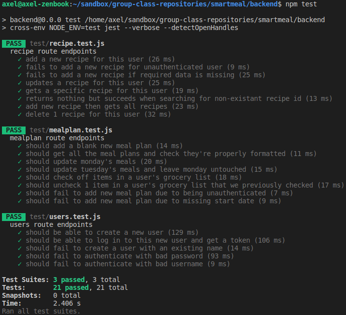
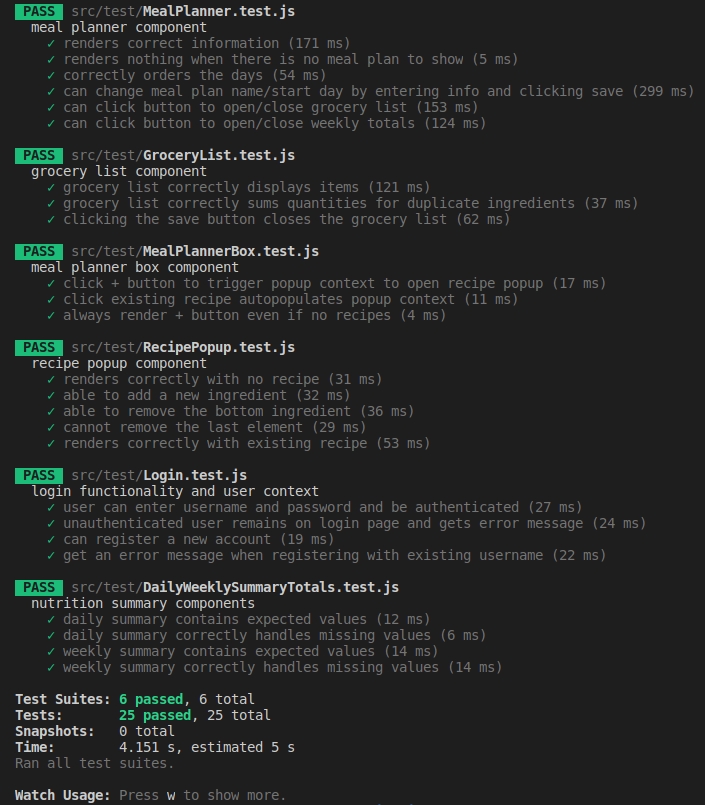

# SmartMeal
Meal planning web app that shows you the nutritional and budgetary impact of your planned meals. Users can create weekly meal plans, save custom recipes, and get auto-generated shopping lists to use at the grocery store.

## Documentation
* SmartMeal's documentation is split into 2 parts: `frontend` and `backend`
* Backend documentation is autogenerated with Postman test cases and can be viewed [on this webpage](https://documenter.getpostman.com/view/7688755/TVetcSDp)
  * Full URL: https://documenter.getpostman.com/view/7688755/TVetcSDp
* Frontend

## Directory organization:
* This project contains two node.js projects, separating the frontend and the backend
* `frontend`: React webapp
* `backend`: Node.js server running Express and MongoDB
  * `backend/test`: testing scripts for the backend

## First-time setup:
1. Install the latest [MongoDB](https://docs.mongodb.com/manual/installation/) (installation differs on Linux, Windows, macOS; select the correct one)
2. Install the latest node.js (recommended to use [nvm](https://github.com/nvm-sh/nvm) on Linux and macOS, [nvm-windows](https://github.com/coreybutler/nvm-windows) on Windows, )
3. Run `npm install` the root directory to install dependencies in both `frontend` and `backend`
4. Install `nodemon` globally if you don't yet have it, as we use it for hot-reloading the backend
```
$ npm install nodemon -g
```
4. The first time you run the webapp, you'll need to create a new user, since the database will be empty. This was previously done with a shell script, but can now be done using the existing UI. If you're feeling adventurous, you can load the script we used using the following commands after starting the `mongod` service (see step 1 in the next section).

```
(Linux/macOS) 
$ mongo < backend/db/load_db.sh
(Windows)   
$ cd "C:\Program Files\MongoDB\Server\4.4\bin" (your absolute path may differ)
$ Get-Content C:\Users\Axel\Documents\smartmeal\backend\db\load_db.sh | .\mongo
```
## Running
1. Start the MongoDB server: 
   * Linux: `mongod`
   * macOS: `brew services start mongodb-community@4.4` (assuming you used `homebrew`)
   * Windows: `cd "C:\Program Files\MongoDB\Server\4.4\bin"`, then `.\mongod`
2. Start the webapp:
   * Method 1: run `npm start` in `frontend/`, and `npm run watch` (hot-reload) or `npm start` (no hot-reload) in `backend/`
   * Method 3 (preferred): run `npm start` in the root directory. This starts the front- and backend simultaneously in a single terminal using a custom `npm` script

## Running tests
* This repository has continuous integration (CI) enabled; all commits to `main` will have our test suites run against them to quickly identify potential bugs and validate all code
* Run all tests at once using `npm test` from the root directory, or run backend and frontend tests separately by running `npm test` in the respective directory
* Backend: uses `Jest` to test API endpoints with `supertest`
  * 3 test suites, one for each set of endpoints (users API, mealplans API, recipes API)
  * Link to directory: https://github.com/cs130-fall2020-team5/smartmeal/tree/main/backend/test
* Frontend: uses `Jest` to test each React component using the `react-testing-library` to inspect rendered HTML
  * 6 test suites, one for each component in `src/components` (with `DailySummary` and `WeeklyTotals` combined into 1 since they are very similar)
  * Link to directory: https://github.com/cs130-fall2020-team5/smartmeal/tree/main/frontend/src/test

### Backend tests:



### Frontend tests:


## Extra useful information:
* Frontend runs on port 4000 (app viewable at `localhost:4000`)
* Backend runs on port 3000


